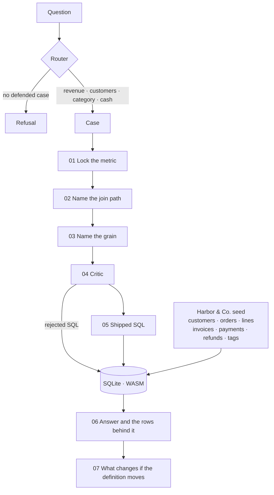
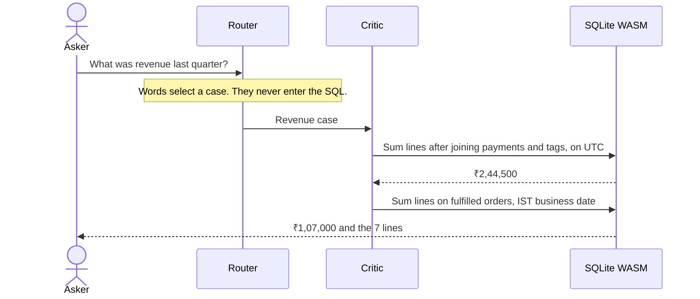

<h1 align="center">Grain</h1>
<p align="center">
  The SQL agent that will not return a number until it can defend it.
</p>
<p align="center">
  <a href="https://skx56.github.io/Grain/"><strong>Open the live demo</strong></a>
</p>

Ask Harbor & Co. what revenue was last quarter.

The query Grain refuses returns **₹2,44,500**. The query it ships returns **₹1,07,000**, with the seven order lines behind that number. Both figures are executed in SQLite, in the browser. The words you type pick a defended case. They are never concatenated into SQL.

The books are frozen at **4 Oct 2026**, so last quarter stays Q3. The ledger is hostile on purpose.

| Question | Rejected | Shipped |
| --- | ---: | ---: |
| Revenue last quarter | ₹2,44,500 | ₹1,07,000 |
| Active customers | 5 | 4 |
| Leading category | Furniture · ₹1,56,000 | Furniture · ₹72,000 |
| Cash collected | ₹2,02,370 | ₹1,26,260 |

The category rank survives the bad query. The amount does not. That is the point.

## Architecture

A question enters a router. The router selects one of four cases. Each case already knows its metric, its join path, its grain, the SQL it will refuse, and the SQL it will defend. The engine runs both against the same in-browser database, then renders the gap.



The critic is not a caption. It executes the naive query, so the bad number is measured.



## Why the naive number is wrong

Harbor & Co. sells lamps, chairs, desks, and shelves. Three clocks and three money columns disagree.

- **Merchandise, invoice total, and cash are different questions.** Invoice totals add 18% tax. Cash is what was captured, including split payments.
- **Joins fan out.** Order 105 has two lines and three tags. Order 102 was paid in two captures. Sum after those joins and the grain is copied.
- **Midnight moves two orders.** Order 106 is 30 Jun 20:30 UTC and 1 Jul 02:00 IST, so it belongs in Q3. Order 107 is the reverse edge and belongs in Q4.
- **A soft delete hides a buyer, not the sale.** Meera Shah’s August order is fulfilled. Her customer row was deleted on 28 Sep 2026.
- **A cancelled order still has a line.** Order 104 is a chair with a void invoice and a failed payment.

## Run it locally

```bash
npm install
npm run dev
```

Open [http://localhost:3000](http://localhost:3000).

```bash
npm run check   # rejected, shipped, and sensitivity numbers
npm run build   # static export in out/
```

`check` is the contract. If a seed change moves a number, the script fails before the README does.
